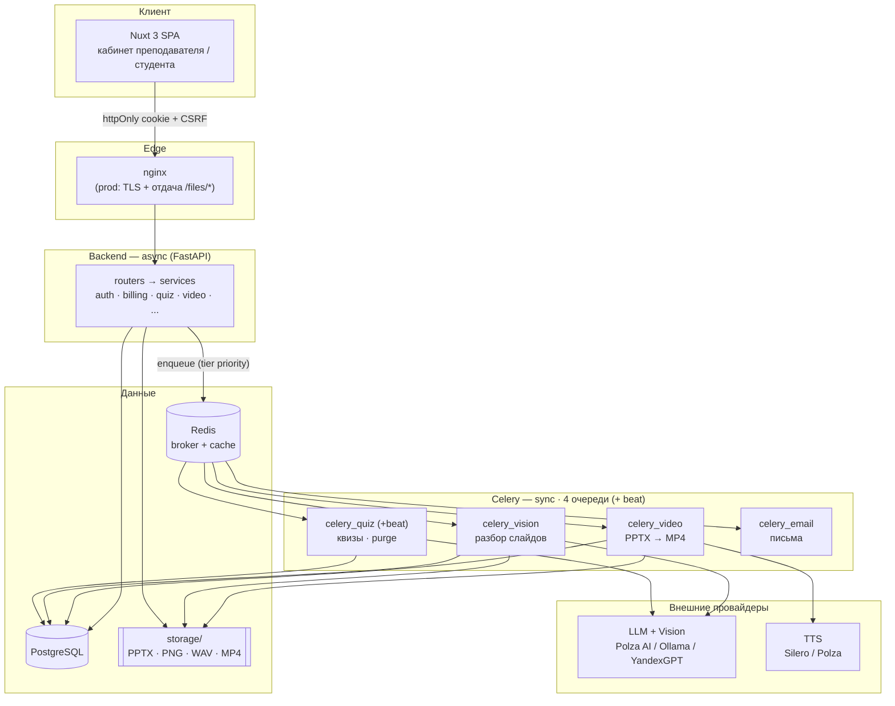
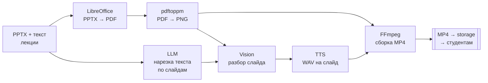

<h1 align="center">Edllm</h1>

<p align="center">
  <strong>LMS + AI-фабрика озвученных видеоуроков.</strong><br/>
  Превращает <code>PPTX + текст доклада</code> в готовую видеолекцию с закадровой озвучкой и раздаёт её студентам.
</p>

<p align="center">
  <a href="LICENSE"></a>
  
  
  
  
  
</p>

<!-- Скриншоты/GIF: положите файлы в docs/assets/ и раскомментируйте.


-->

> [!WARNING]
> **TTS по умолчанию — Silero, русские модели (CC-BY-NC 4.0): бесплатно только для НЕкоммерческого использования.**
> Для коммерческого запуска переключите `TTS_PROVIDER=polza` (или Yandex SpeechKit), либо возьмите Silero Enterprise-лицензию (hello@silero.ai). Подробности — [THIRD_PARTY_LICENSES.md](THIRD_PARTY_LICENSES.md).

---

## Что это и для кого

**Edllm** — самостоятельно хостимая SaaS-LMS для связки «преподаватель ↔ студент».
Её ключевая фича — конвейер, который из презентации и текста лекции автоматически
собирает **narrated MP4**: LLM режет текст по слайдам, vision-модель разбирает
каждый слайд, TTS озвучивает, FFmpeg склеивает видео. Готовый урок публикуется
записанным на курс студентам.

Вокруг этого ядра — полноценный LMS: курсы и модули, AI-квизы, задания с загрузкой
файлов, журнал оценок, аналитика и биллинг по кредитам.

- **Преподавателю** — не нужен видеоредактор: загрузил PPTX + скрипт → получил курс с озвученными уроками.
- **Студенту** — записался по коду доступа → смотрит уроки, проходит квизы, сдаёт задания, видит прогресс.

## Ключевые фичи

- 🎬 **PPTX → видеоурок** — LLM-нарезка текста → vision-разбор слайдов → TTS → FFmpeg-сборка MP4 (стриминговый конвейер: кодирование слайда стартует, как только готово его аудио).
- 📼 **Прямая загрузка видео** — готовый MP4/WebM/MOV без AI-пайплайна и без списания кредитов.
- 📚 **Курсы, модули, уроки** — публикация по флагам, доступ по коду записи, обложки курсов.
- 🧠 **AI-квизы** — генерация 8 типов вопросов; бесплатная LLM-проверка открытых ответов студентов с анти-абьюз лимитами.
- 📝 **Задания** — текстовые задачи, загрузка файлов студентом, оценки и приватный тред «преподаватель ↔ студент» на каждую сдачу.
- 💬 **Комментарии** к урокам, 📊 **журнал оценок** и **аналитика** (посещаемость квизов, средний балл, pass rate, ручной override оценок).
- 💳 **Биллинг по кредитам** — AI-операции резервируют кредиты и списывают по факту; планы, помесячные лимиты, разовые пакеты; платежи через **YooKassa**.
- 🔐 **Аутентификация на httpOnly-cookie + double-submit CSRF**, Argon2id, ротация refresh-токенов с детекцией повторного использования.

## Архитектура

Асинхронный FastAPI принимает запросы; долгие задачи уходят в **синхронные** Celery-воркеры (4 очереди + один beat), связь через Redis, состояние — в PostgreSQL, файлы — в `storage/` (local) или S3.



**Конвейер генерации видео:**



Подробнее — [docs/ARCHITECTURE.md](docs/ARCHITECTURE.md), сквозные сценарии — [docs/DATA_FLOW.md](docs/DATA_FLOW.md), авторизация — [docs/AUTH_FLOW.md](docs/AUTH_FLOW.md).

## Стек

| Слой | Технологии |
|---|---|
| **Backend** | FastAPI 0.136 · SQLAlchemy 2 (async) · asyncpg · Alembic · Pydantic v2 |
| **Фон** | Celery 5.6 (4 очереди + beat) · Redis 7 |
| **БД** | PostgreSQL 17 |
| **AI** | OpenAI-совместимый LLM/Vision (Polza AI · Ollama · YandexGPT) · Silero / Polza TTS |
| **Медиа** | LibreOffice headless · poppler (`pdftoppm`) · FFmpeg |
| **Frontend** | Nuxt 3 (SPA) · Vue 3 · Pinia · Tailwind CSS |
| **Хранилище** | local (`storage/`) или S3 / Yandex Object Storage |
| **Платежи / почта** | YooKassa · Resend |
| **Наблюдаемость** | Sentry · Prometheus · Grafana · Flower · structlog (JSON) |
| **Инфра** | Docker Compose · nginx · certbot (prod) |

## Быстрый старт

```bash
git clone <repo-url> && cd edu-platform
cp .env.example .env        # значения-плейсхолдеры уже проставлены; см. комментарии в файле

docker-compose up --build

# Первый запуск: создать и применить схему БД (миграции генерируются локально,
# в репозиторий не коммитятся — модели являются источником истины).
docker-compose exec backend alembic revision --autogenerate -m "init"
docker-compose exec backend alembic upgrade head
```

> [!CAUTION]
> **Никогда не запускайте `npm install` / `npm ci`** — ни на хосте, ни в контейнере.
> На Windows это создаёт `node_modules` с Windows-бинарниками, ломающими Linux-контейнер frontend'а.
> Все JS-зависимости управляются образом. Подробности — [CONTRIBUTING.md](CONTRIBUTING.md).

Проверить, что стек поднялся:

| | URL |
|---|---|
| Frontend | http://localhost:3000 |
| API + Swagger | http://localhost:8000/docs |
| Health | http://localhost:8000/health |
| Grafana · Flower · Prometheus | http://localhost:3001 · http://localhost:5555 · http://localhost:9090 |

**Нужен внешний LLM/Vision-провайдер** — единственное, что не поднимают контейнеры.
По умолчанию `.env.example` указывает на **Polza AI** (облако, OpenAI-совместимый). Без рабочего провайдера генерация видео падает на шаге LLM-нарезки / vision-разбора.

## Конфигурация

Вся настройка — через `.env` (шаблон: [.env.example](.env.example), для прода — [.env.prod.example](.env.prod.example)). Каждая переменная прокомментирована в файле; здесь — только основные переключатели.

**LLM / Vision** — смена провайдера это правка env, без изменения кода (все говорят по OpenAI-протоколу):

```env
# Облако (дефолт) — Polza AI
LLM_BASE_URL=https://api.polza.ai/v1
LLM_API_KEY=pza_...

# Локально — Ollama на хосте (ollama pull qwen3 && ollama pull qwen2.5vl:7b)
LLM_BASE_URL=http://host.docker.internal:11434/v1
LLM_MODEL=qwen3:8b
LLM_API_KEY=ollama
```

**TTS** — `TTS_PROVIDER=silero` (локальный контейнер, self-host/dev, **non-commercial**) или `TTS_PROVIDER=polza` (облако, пригодно для коммерции). См. предупреждение о лицензии выше.

**Секреты** — `SECRET_KEY` сгенерируйте через `openssl rand -hex 32`; в продакшене слабый ключ отклоняется на старте. Заполненные `.env` / `.env.prod` **не коммитятся** (в `.gitignore`).

> 🌐 **Форкаете под свой домен?** В `nginx/prod.conf`, `deploy/init-letsencrypt.sh`, `docker-compose.prod.yml` и `.env.prod.example` замените `edllm.ru` на свой домен, а `you@example.com` — на свой email для Let's Encrypt.

## Структура проекта

```
backend/
  app/
    main.py          # FastAPI-приложение, middleware, lifespan
    config.py        # настройки (pydantic-settings)
    constants.py     # все тюнинги: пулы, лимиты, планы, тарифы
    celery_app.py    # Celery: очереди, роутинг, beat
    dependencies.py  # авторизация (require_teacher / require_verified_* / ...)
    routers/         # тонкие HTTP-маршруты
    services/        # вся бизнес-логика (llm, tts, video, auth, billing, quiz, ...)
    tasks/           # Celery-задачи (video/vision/quiz/purge/email pipeline)
    models/          # SQLAlchemy ORM
    schemas/         # Pydantic v2 DTO
  alembic/           # миграции (генерируются локально)
  tests/             # unit/ + integration/
frontend/
  src/
    pages/           # файловый роутинг Nuxt
    components/      # Vue-компоненты
    composables/     # useApi (единый fetch-wrapper), ...
    stores/          # Pinia (auth, billing, comments, ...)
docs/                # ARCHITECTURE, DATA_FLOW, AUTH_FLOW, DECISIONS, ...
nginx/ · deploy/ · monitoring/   # инфраструктура
```

## Разработка

Всё выполняется внутри контейнеров:

```bash
# Тесты бэкенда (testcontainers поднимает sibling-Postgres через host-сокет)
docker-compose exec backend pytest -m "not slow"     # канонический прогон
docker-compose exec backend pytest tests/unit          # только unit
docker-compose exec backend pytest tests/integration   # только роуты

# Линт (ruff: E, F, I · длина строки 100 · target py313)
docker-compose exec backend ruff check app

# Тесты фронтенда (npm запрещён — вызываем бинарь напрямую)
docker-compose exec frontend node_modules/.bin/vitest run

# Новая миграция после правки моделей
docker-compose exec backend alembic revision --autogenerate -m "describe change"
```

Как добавить роут / модель / Celery-задачу и прочие конвенции — в [CONTRIBUTING.md](CONTRIBUTING.md).
Продакшен-развёртывание (gunicorn, миграции как деплой-шаг, TLS, бэкапы) — в [docs/DEPLOYMENT.md](docs/DEPLOYMENT.md).

## Документация

- [docs/ARCHITECTURE.md](docs/ARCHITECTURE.md) — общая картина и неочевидные решения
- [docs/DATA_FLOW.md](docs/DATA_FLOW.md) — сквозные сценарии
- [docs/AUTH_FLOW.md](docs/AUTH_FLOW.md) — аутентификация и сессии
- [docs/DECISIONS.md](docs/DECISIONS.md) — журнал архитектурных решений
- [docs/KNOWN_PROBLEMS.md](docs/KNOWN_PROBLEMS.md) — известный техдолг (загляните сюда прежде, чем «чинить» странное)
- [docs/DEPLOYMENT.md](docs/DEPLOYMENT.md) · [docs/ROADMAP.md](docs/ROADMAP.md) · [docs/GROWTH.md](docs/GROWTH.md)

## Лицензия

Исходный код — **[MIT](LICENSE)**.

> [!IMPORTANT]
> ⚠️ **Про лицензию TTS.** MIT покрывает только код этого репозитория и **не** перелицензирует зависимости. Дефолтный движок TTS — **Silero (русские модели `v5_ru`/`v5_5_ru`) — CC-BY-NC 4.0, только некоммерческое использование.** Для коммерции: `TTS_PROVIDER=polza` / Yandex SpeechKit, либо Silero Enterprise (hello@silero.ai). Также обратите внимание на FFmpeg/poppler (GPL/LGPL) и лицензионную историю Redis.

Полная инвентаризация сторонних лицензий — [THIRD_PARTY_LICENSES.md](THIRD_PARTY_LICENSES.md).
Как сообщить об уязвимости — [SECURITY.md](SECURITY.md).
